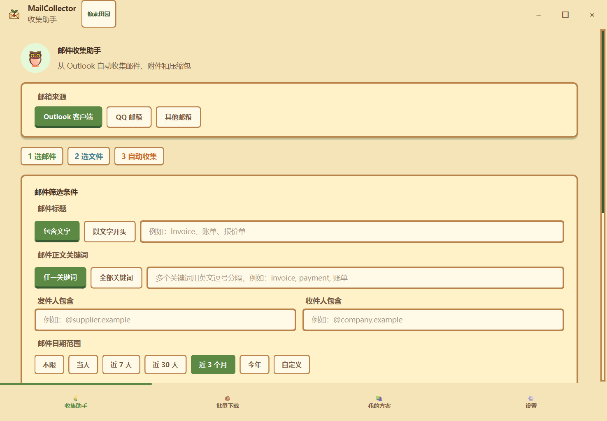

# MailCollector Desktop · 邮件与附件自动收集工具

一个面向 Windows 办公场景的桌面自动化工具，可从 Outlook 客户端或 IMAP 邮箱中筛选邮件，批量保存附件与邮件文件，并把常用筛选条件保存为可复用方案。



## 适用场景

- 按主题、正文、发件人、收件人和日期范围批量查找邮件
- 仅收集包含附件的邮件，并按扩展名筛选文件
- 批量导出附件、完整邮件或两者同时导出
- 自动解压 ZIP/RAR/7Z，并对重复文件自动改名
- 保存常用筛选方案，支持按计划定时执行
- 在 Outlook 本地客户端和标准 IMAP 邮箱之间切换

## 技术实现

- Python / PySide6 桌面 GUI
- Outlook COM 自动化（pywin32）
- IMAP4 SSL
- QThread 后台任务与进度反馈
- JSON 方案持久化
- 日期动态窗口、附件类型过滤和文件归档

## 安全设计

- IMAP 密码仅用于当前运行，不写入 `plans.json`
- 已保存的 IMAP 方案会保留服务器、端口和账号，但不会保留密码
- 定时执行 IMAP 方案时，可以通过环境变量 `MAILCOLLECTOR_IMAP_PASSWORD` 提供运行密码
- 仓库不包含真实邮箱、邮件内容、Cookie、Token 或账号凭据

## 运行

要求 Windows 10/11 和 Python 3.10+。

```powershell
python -m pip install -r requirements.txt
python src/launch.pyw
```

也可以双击 `start.bat`。

Outlook 模式需要安装桌面版 Outlook。IMAP 模式建议使用邮箱服务商提供的应用专用密码，不要直接使用主账号密码。

## 项目结构

```text
src/
  launch.pyw          # 桌面启动入口
  mail_collector.py   # GUI、筛选、导出和计划任务
docs/
  mailcollector-overview.png
requirements.txt
start.bat
```

## 简历摘要

使用 Python、PySide6、Outlook COM 与 IMAP 独立开发桌面邮件自动化工具，实现多条件筛选、附件批量导出、自动解压、方案复用和定时任务，并通过线程化执行避免界面阻塞。

## 隐私说明

处理真实邮箱时，请遵守所在组织的数据安全和授权要求。建议先在测试邮箱和非敏感目录中验证筛选规则，再用于正式邮件归档。
